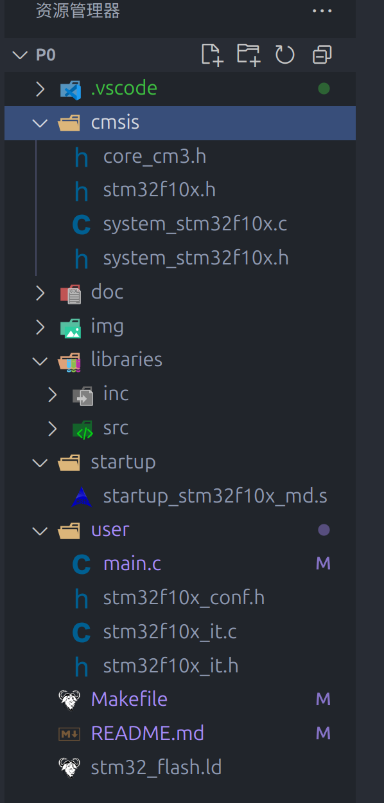

# STM32 工程模板
> 记录在 `Linux` 平台上搭建 `STM32` 开发链过程中遇到的一些困难以及解决方案

操作系统: `Ubuntu24.04`

开发工具链: `arm-none-eabi-gcc + gdb-multiarch + vscode + cortex-debug + openocd`

## 开发环境搭建

首先需要安装相关的工具:

```shell
sudo apt install gcc-arm-none-eabi gdb openocd
```

- `gcc-arm-none-eabi`:  `arm` 架构下的编译器
- `gdb-multiarch`: 多架构平台下的调试器, 用于 `STM32` 程序调试
- `openocd`: 烧录以及调试工具(配合 `gdb` 使用), 需要指定配置文件, 一般配置文件在 `/usr/share/openocd/scripts` 目录中可以找到(如果是通过 `apt` 安装的话)

## 项目结构

项目结构如下:



目录中相关文件可以到固件库中下载(在 `ST` 官网下载对应的库文件), 各个目录的作用如下:

- `CMSIS`: 提供对应的内核支持以及设备支持
- `libraries`: 标准库
- `startup`: 启动文件, 注意由于这里使用 `stm32f103c8t6` , `flash` 容量为中等容量, 所以只用后缀 `md`(其他情况需要使用不同的启动文件, 固件库中有)

- `user`: 用户代码(中断程序 + 头文件汇总)

- `Makefile`: 用于构建项目
- `stm32_flash.ld`: 可能是引导程序(?), 但是需要根据 `flash` 和 `ram` 容量选择对应的链接文件

## 项目构建

最核心的部分就是 [`Makefile`](./Makefile) , 特别注意其中的 `download` 和 `debug` 目标

## vscode 配置

首先说明一下 `vscode` 中使用的三个配置文件:

- `c_cpp_properties.json`: 配置 `C/C++` 编译器, 头文件路径等信息, 用于语法高亮以及报错显示
- `launch.json`: 与调试相关, 可以指定使用的调试器以及调试类型
- `tasks.json`: 与任务配置相关, 可以在其中配置对应的任务, 任务执行: `Ctrl + Shift + P` 打开命令面板, 输入 `Tasks: Run Tasks` , 选择对应的任务即可

相关的配置可以参考 [`.vscode`](./.vscode) , 但是注意首先需要安装插件 `coterx-debug`,  ~~**注意不要在 `tasks.json` 中配置阻塞的任务, 同时在 `launch.json` 中引用该任务**~~

